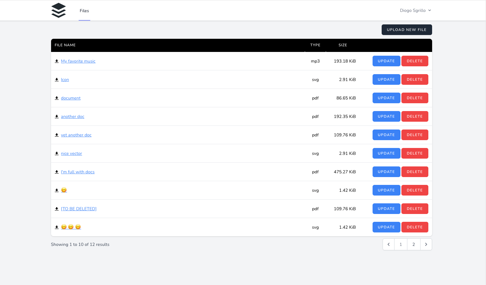

<!-- PROJECT LOGO -->
<br />

<p align="center">
  
  <h3 align="center">File Manager Web App</h3>

  <p align="center">
    A simple media library for managing your files.
  </p>
  
  
</p>

<!-- TABLE OF CONTENTS -->
<details open="open">
  <summary>Table of Contents</summary>
  <ol>
    <li><a href="#built-with">Built With</a></li>
    <li>
      <a href="#getting-started">Getting Started</a>
      <ul>
        <li><a href="#installation">Installation</a></li>
      </ul>
    </li>
    <li><a href="#license">License</a></li>
    <li><a href="#contact">Contact</a></li>
  </ol>
</details>

### Built With

* [Tailwind](https://tailwindcss.com/)
* [AlpineJS](https://github.com/alpinejs/alpine)
* [Laravel](https://laravel.com)


<!-- GETTING STARTED -->
## Getting Started

To get a local copy up and running follow these steps.


### Installation

1. Clone the repo
   ```sh
   git clone https://github.com/dsgrillo/file-manager
   ```
2. Install composer dependencies
   ```sh
   docker run --rm \
       -u "$(id -u):$(id -g)" \
       -v $(pwd):/opt \
       -w /opt \
       laravelsail/php80-composer:latest \
       composer install
   ```
3. Start the container
   ```ssh
   ./vendor/bin/sail up -d
   ```
4. Setup the database
   ```sh
   sail artisan migrate
   ```
5. Navigate to [localhost](http://localhost)

<!-- LICENSE -->
## License

Distributed under the MIT License. See `LICENSE` for more information.

<!-- CONTACT -->
## Contact

Diogo Sgrillo

Project Link: [https://github.com/dsgrillo/file-manager](https://github.com/dsgrillo/file-manager)
